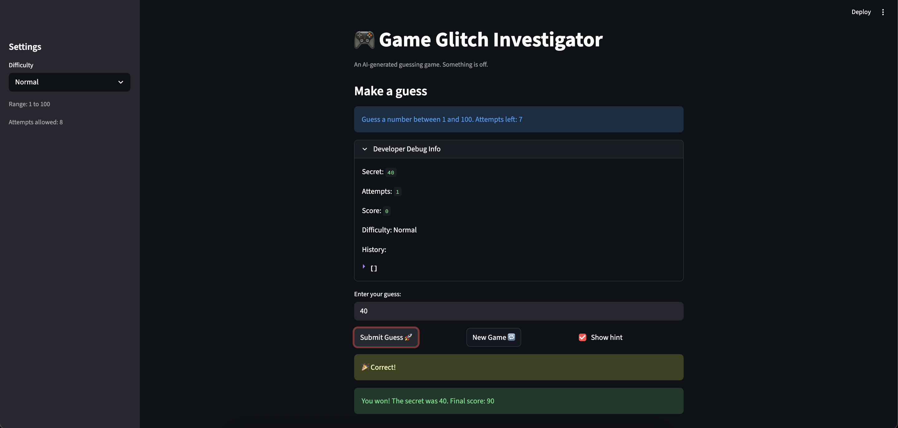

# 🎮 Game Glitch Investigator: The Impossible Guesser

## 🚨 The Situation

You asked an AI to build a simple "Number Guessing Game" using Streamlit.
It wrote the code, ran away, and now the game is unplayable. 

- You can't win.
- The hints lie to you.
- The secret number seems to have commitment issues.

## 🛠️ Setup

1. Install dependencies: `pip install -r requirements.txt`
2. Run the broken app: `python -m streamlit run app.py`

## 🕵️‍♂️ Your Mission

1. **Play the game.** Open the "Developer Debug Info" tab in the app to see the secret number. Try to win.
2. **Find the State Bug.** Why does the secret number change every time you click "Submit"? Ask ChatGPT: *"How do I keep a variable from resetting in Streamlit when I click a button?"*
3. **Fix the Logic.** The hints ("Higher/Lower") are wrong. Fix them.
4. **Refactor & Test.** - Move the logic into `logic_utils.py`.
   - Run `pytest` in your terminal.
   - Keep fixing until all tests pass!

## 📝 Document Your Experience

- [x] **Describe the game's purpose.**

  This is a number guessing game built with Streamlit. The player picks a difficulty (Easy, Normal, or Hard), which sets a secret number range and an attempt limit. Each round the app picks a random secret number and the player types guesses until they find it or run out of attempts. Correct guesses earn points, and the score is tracked across the session.

- [x] **Detail which bugs you found.**

  | # | Bug | Where |
  |---|-----|-------|
  | 1 | **Backwards hints** — "Go HIGHER!" appeared when the guess was too high, and "Go LOWER!" when it was too low. Both messages were swapped. | `check_guess` in `app.py` |
  | 2 | **No input validation** — Decimal numbers like `3.7` were silently truncated to `3` and accepted. Negative numbers and values above the upper bound also passed through with no warning. | `parse_guess` in `app.py` |
  | 3 | **Hard difficulty easier than Normal** — Hard had a range of 1–50 while Normal had 1–100, meaning "Hard" was actually narrower and easier to guess. | `get_range_for_difficulty` in `app.py` |
  | 4 | **Score could go negative** — Every wrong guess subtracted 5 points regardless of context, and "Too High" on even-numbered attempts added 5 in an arbitrary pattern, making the scoring unpredictable and unfair. | `update_score` in `app.py` |
  | 5 | **Incomplete new-game reset** — Clicking "New Game" only reset `attempts` and generated a new secret. `score`, `status`, and `history` were left over from the previous round. The new secret also ignored the current difficulty and always used range 1–100. | `new_game` handler in `app.py` |
  | 6 | **Secret type alternation** — On even-numbered attempts the secret was converted to a string before being passed to `check_guess`, causing type-mismatch comparisons that made correct guesses undetectable. | Submit handler in `app.py` |

- [x] **Explain what fixes you applied.**

  1. **Swapped the hint messages** in `check_guess` so `guess > secret` returns "Go LOWER!" and `guess < secret` returns "Go HIGHER!".
  2. **Rewrote `parse_guess`** to accept `low` and `high` parameters, explicitly reject any input containing `.`, and reject values outside the valid range with a descriptive error message.
  3. **Changed Hard's range to 1–200** in `get_range_for_difficulty`, making it genuinely harder than Normal (1–100) and Easy (1–20).
  4. **Simplified `update_score`** to only award points on a win (`max(10, 100 − 10 × (attempt − 1))`), eliminating arbitrary deductions and preventing negative scores.
  5. **Fixed the new-game handler** to reset `score`, `status`, and `history` in addition to `attempts`, and to generate the new secret using the current difficulty's range instead of hardcoded 1–100.
  6. **Removed the int/str alternation** — the submit handler now always passes `st.session_state.secret` (an integer) directly to `check_guess`.
  7. **Refactored all four logic functions** (`get_range_for_difficulty`, `parse_guess`, `check_guess`, `update_score`) out of `app.py` and into `logic_utils.py`, leaving `app.py` as pure UI code.
  8. **Updated the info banner** to display the actual difficulty range instead of the hardcoded "1 and 100".

## 📸 Demo

- [ ] [Insert a screenshot of your fixed, winning game here]

## 🚀 Stretch Features

- [ ] [If you choose to complete Challenge 4, insert a screenshot of your Enhanced Game UI here]
